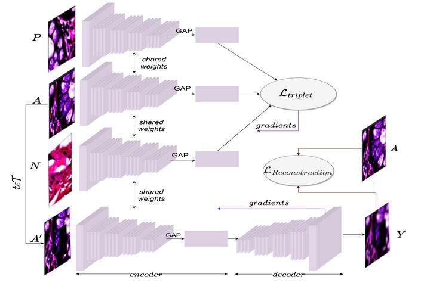
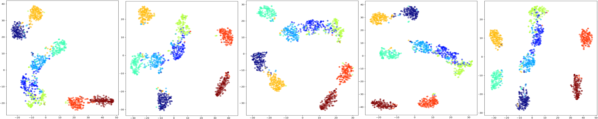
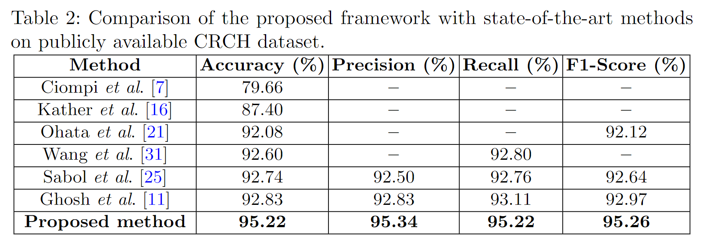

# Supervision meets Self-Supervision: A Deep Multitask Network for Colorectal Cancer Histopathological Analysis, MISP 2022 

Aritra Marik, **Soumitri Chattopadhyay** and Pawan Kumar Singh, [**“Supervision meets Self-supervision: A Deep Multitask Network for Colorectal Cancer Histopathological Analysis”**](https://github.com/soumitri2001/DMTNet-CRCH/raw/main/preprint/DMTNet.pdf), _Accepted for Oral Presentation at_ **Intl. Conf. on Machine Intelligence and Signal Processing (MISP), 2022.**

⚡ **Update:** Winner of [**Best Paper Award**](https://drive.google.com/file/d/1CTmlRrijHKY5xUPtGd7YdGu3aOvYfw_S/view?usp=sharing) at MISP 2022 ! ⚡
## Abstract
Colorectal cancer is one of the most common types of cancer worldwide and the leading cause of death due to cancer. As such, an early detection and diagnosis is of paramount importance, which is however, limited due to insufficient medical practitioners available for large-scale histopathological screening. This demands for a reliable computer-aided framework that can automatically analyse histopathological slide images and assist pathologists in quick decision-making. To this end, we propose a novel deep learning framework that combines supervised learning with self-supervision for robust learning of histopathological features from colorectal tissue images. Specifically, our framework comprises a multitask training pipeline using deep metric learning that learns the embedding space using triplet loss, which is augmented using a self-supervised image reconstruction module that enhances learning of pixel-level texture features. The downstream classification is done by extracting features using the pre-trained encoder and feeding them into a support vector machine classifier. We perform qualitative and quantitative analysis on a publicly available colorectal cancer histopathology dataset, as well as compare the proposed framework against some state-of-the-art works, where the model is found to outperform several existing works in literature.

## Framework


## Results
<br>


## Requirements
To install the required dependencies run the following in command prompt:
`pip install -r requirements.txt`

## Running the codes:
Required directory structure:

```
+-- data
|   +-- .
|   +-- train
|   +-- val
+-- dataset.py
+-- main.py
+-- model.py
+-- Network_modules.py
+-- requirements.txt
```
Then, run the code using the command prompt as follows:

`python main.py --data_dir "./path/to/data"`

**Hyperparameters (available as arguments):**
- `--num_epochs` : number of training epochs. Default = 200
- `--learning_rate` : learning rate for training. Default = 0.01
- `--batchsize` : batch size for training. Default = 32
- `--margin` : triplet loss margin value > 0. Default = 0.2
- `--lambd` : loss balancing factor. Default = 10

## Citation
If you find this article useful in your research, consider citing us:
```
@inproceedings{marik2022supervision,
    author = {Aritra Marik and Soumitri Chattopadhyay and Pawan Kumar Singh},
    title = {Supervision meets Self-supervision: A Deep Multitask Network for Colorectal Cancer Histopathological Analysis},
    booktitle = {International Conference on Machine Intelligence and Signal Processing (MISP)},
    year = {2022}
}
```
